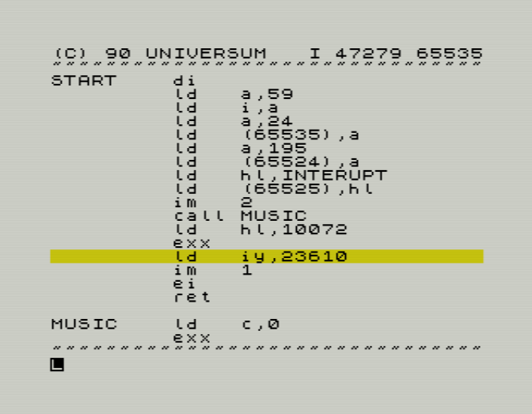

# PROMETHEUS for the ZX Spectrum


This repository contains the reconstructed and extensively annotated source code of **PROMETHEUS**, the ZX Spectrum assembler, editor and machine-code monitor published by Proxima.

The active source has been updated from the PROMETHEUS resurrection project. The machine-emitting statements in this snapshot still reproduce the historical program byte for byte, while labels and comments describe the program at routine, data-structure and algorithm level.



## Build a TAP image

The repository contains only the tools required to assemble the checked-in sources and place the resulting CODE block into a loadable ZX Spectrum TAP image.

### Requirements

- Python 3
- `z80asm` 1.8 or a compatible version

On Debian or Ubuntu:

```sh
sudo apt install z80asm python3
```

### Build

Run from the repository root:

```sh
./compile.sh
```

The build creates:

```text
out/prometheus.bin
out/prometheus.tap
```

`prometheus.bin` is assembled from `src/prometheus.asm`. The source includes the instruction, relocation and installation-configuration tables from the same directory.

`prometheus.tap` is created from `tap/prometheus-48.tap`. The builder replaces its `prometheus` CODE block with the newly assembled binary, updates the CODE-header length, and recalculates the affected Spectrum tape checksums. The remaining loader and tape blocks are preserved byte for byte. Unlike the old build script, this process also accepts a changed binary length and does not require the result to match the historical binary.

## Source files

- `src/prometheus.asm` — complete installer, monitor, editor and two-pass assembler source.
- `src/instructionTable.asm` — packed mnemonic and operand-description tables.
- `src/relocationTable.asm` — checked-in relocation streams used by the installer.
- `src/configurationPatchTable.asm` — checked-in installer configuration-patch stream.

The relocation and configuration tables are generated metadata in the full resurrection development project, but are committed here so the build requires no regeneration or analysis toolchain.

## Build tools

- `compile.sh` — assembles the program and creates the TAP image.
- `tools/build_tap_from_template.py` — replaces a named CODE block in a Spectrum TAP template and updates lengths and XOR checksums.

The previous SkoolKit-based `bin2tap.py` dependency is no longer used.

## Historical material

The remaining directories contain the original binary, manuals, screenshots, tape and disk images, and supporting disassembly material from the earlier repository.

With the sources unchanged, the current build produces:

```text
prometheus.bin  18,356 bytes
SHA-256         940f793ad99351507d857b1d96a79bfcf3395d2e1577d633595ab7eaa67edce8

prometheus.tap  26,101 bytes
SHA-256         29111b19fb680199b6ed3eee07bbd62757a25a8baefe2454a497d2f35c46a93f
```
